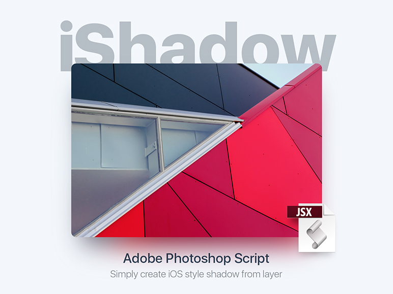
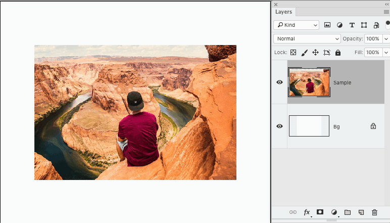

# iShadow v0.4

**iShadow is a helpful FREE Photoshop script for Web and UI designers.  
Script create iOS 10 style shadow for selected layer.**

## Install

1. [Download archive] and unzip
2. Place `iShadow.jsx` in the Photoshop Scripts folder:
	- OS X: `/Applications/Adobe Photoshop [version]/Presets/Scripts/`
	- Windows (32 bit): `C:\Program Files (x86)\Adobe\Adobe Photoshop [version]\Presets\Scripts\`
	- Windows (64 bit): `C:\Program Files\Adobe\Adobe Photoshop [version] (64 Bit)\Presets\Scripts\`
3. Restart Photoshop
4. You can also setup a custom hotkey in `Edit → Keyboard Shortcuts…`

[Download archive]: https://github.com/creold/iShadow/archive/master.zip

## Usage

1. Select an layer
2. Choose `File → Scripts → iShadow`
3. Enter the values in the fields or drag sliders
4. Click `OK`

**Attention:** Script working with layer and smart object too.

## System Requirements

Adobe Photoshop CS3 and higher.  
The script has been tested on Photoshop CS5 (Windows 7), Photoshop CC 2017 (OS X El Capitan).

## Release notes

| Version | Notes |
| --- | --- |
| **v0.4** | Now the script remembers the previous values after the last run. |
| **v0.3** | Added sliders to set values. |
| **v0.2** | Added `Preview changes` checkbox. |
| **v0.1** |  First Release. |

### Donate (optional)
Buy me a glassful of fresh juice to give me work energy: [pay $1 by PayPal] or [Yandex Money] 🙂

[pay $1 by PayPal]: https://paypal.me/osokin/1usd
[Yandex Money]: https://money.yandex.ru/to/410011149615582

### Feedback & Help

Found a bug? Please [submit a new issues](https://github.com/creold/iShadow/issues) here on GitHub.

### Sketch plugin
If you work in Sketch app check this [iShadow] page. Author Oleg Frolov.

[iShadow]: https://github.com/Volorf/iShadow

### License

iShadow is licensed under the MIT licence.  
See the included LICENSE file for more details.

**&copy; Sergey Osokin**   
Medium: [@Creold](medium.com/@creold/)  
Behance: [https://behance.net/creold](https://behance.net/creold) 